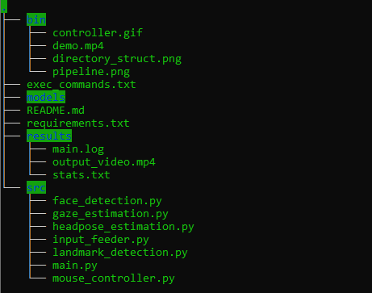

# Computer Pointer Controller

Computer Pointer Controller is a smart application which leverages pre-trained OpenVino models wherein it infers the gaze direction of the subject in a video or webcam feed, and moves the mouse pointer accordingly in that direction.


## Project Set Up and Installation

### Setup Details

|   Details |            |
| ------------------ | ---------- |
| Programming Language | Python 3.**6** |
| OpenVino Toolkit Version | 2020.**3** |
| Hardware Used | Intel CPU i7 3rd Gen |
| Enviroments Used | Windows WSL, Ubuntu 18.04 |

OpenVino installation guide can be found [here](https://docs.openvinotoolkit.org/latest/index.html).

### Directory Structure



### Dependencies
The following models need to be placed in the ```./models``` directory.
| Pre-trained Models | Model Precision |
| ------------------- | :----------------: |
| face-detection-adas-binary-0001 | **FP32-INT1** |
| landmarks-regression-retail-0009 | **FP16**, **FP32**, **FP16-INT8** |
| head-pose-estimation-adas-0001 | **FP16**, **FP32**, **FP16-INT8** |
| gaze-estimation-adas-0002 | **FP16**, **FP32**, **FP16-INT8** |

Information regarding above pre-trained models can be found [here](https://docs.openvinotoolkit.org/latest/_models_intel_index.html).

Information regarding above InferenceEngine API can be found [here](https://docs.openvinotoolkit.org/latest/ie_python_api/annotated.html).

### Downloading pre-trained models
Face Detection Model
```
python3 <openvino directory>/deployment_tools/tools/model_downloader/downloader.py --name face-detection-adas-binary-0001 --output_dir out_dir_path
```
Facial Landmarks Detection Model
```
python3 <openvino directory>/deployment_tools/tools/model_downloader/downloader.py --name landmarks-regression-retail-0009 --output_dir out_dir_path
```
Head Pose Estimation Model
```
python3 <openvino directory>/deployment_tools/tools/model_downloader/downloader.py --name head-pose-estimation-adas-0001 --output_dir out_dir_path
```
Gaze Estimation Model
```
python3 <openvino directory>/deployment_tools/tools/model_downloader/downloader.py --name gaze-estimation-adas-0002 --output_dir out_dir_path
```
where out_dir_path is the path to ```./models``` folder

### Virtual Environment Setup

Install ```pip``` and ```virtualenv``` modules
```
sudo apt-get install python3-pip
sudo pip3 install virtualenv
```
Create a virtual environment
```
virtualenv -p /usr/bin/python3.6 env_name
```
Activate virtual environment
```
source env_name/bin/activate
```
To deactive the environment
```
deactivate
```

### Install pre-requisites

```
sudo apt-get install python3-tk python3-dev
pip3 install -r requirements.txt
pip3 install pyautogui
```

### Application Workflow Pipeline


## Demo

After changing to the project directory, the following command is used to run the application using FP16 model precision:
```
python3 src/main.py \
-fd ./models/face-detection-adas-binary-0001/FP32-INT1/face-detection-adas-binary-0001 \
-fl ./models/landmarks-regression-retail-0009/FP16/landmarks-regression-retail-0009 \
-hp ./models/head-pose-estimation-adas-0001/FP16/head-pose-estimation-adas-0001 \
-ge ./models/gaze-estimation-adas-0002/FP16/gaze-estimation-adas-0002 \
-i ./bin/demo.mp4 -d CPU -pt 0.6 -o ./results -vid 1 -flag fd fl hp ge
```
The FP16 in ```-fl``` , ```-hp``` and ```-ge``` arguments should be replaced with the desired precisions available in the models directory

## Documentation

The arguments accepted by the application are as follows:
```
usage: main.py [-h] -fd FACE_DETECTION_MODEL -fl FACIAL_LANDMARK_MODEL -hp
               HEAD_POSE_MODEL -ge GAZE_ESTIMATION_MODEL -i INPUT
               [-ext CPU_EXTENSION] [-pt PROB_THRESHOLD] [-o OUTPUT_PATH]
               [-vid SHOW_VIDEO] [-d DEVICE]
               [-flag VISUALIZATION_FLAG [VISUALIZATION_FLAG ...]]

optional arguments:
  -h, --help            show this help message and exit
  -fd FACE_DETECTION_MODEL, --face_detection_model FACE_DETECTION_MODEL
                        Path to an .xml file with Face Detection model.
  -fl FACIAL_LANDMARK_MODEL, --facial_landmark_model FACIAL_LANDMARK_MODEL
                        Path to an .xml file with Facial Landmark Detection
                        model.
  -hp HEAD_POSE_MODEL, --head_pose_model HEAD_POSE_MODEL
                        Path to an .xml file with Head Pose Estimation model.
  -ge GAZE_ESTIMATION_MODEL, --gaze_estimation_model GAZE_ESTIMATION_MODEL
                        Path to an .xml file with Gaze Estimation model.
  -i INPUT, --input INPUT
                        Path to image or video file or CAM
  -ext CPU_EXTENSION, --cpu_extension CPU_EXTENSION
                        MKLDNN (CPU)-targeted custom layers.Absolute path to a
                        shared library with thekernels impl.
  -pt PROB_THRESHOLD, --prob_threshold PROB_THRESHOLD
                        Probability threshold for detection fitering.
                        Default:0.6
  -o OUTPUT_PATH, --output_path OUTPUT_PATH
                        Path to save outputs. Default: /results
  -vid SHOW_VIDEO, --show_video SHOW_VIDEO
                        Flag to display the video output. 0: hide(default),
                        1:display
  -d DEVICE, --device DEVICE
                        Specify the target device to infer on: CPU, GPU, FPGA
                        or MYRIAD is acceptable. Sample will look for a
                        suitable plugin for device specified (CPU by default)
  -flag VISUALIZATION_FLAG [VISUALIZATION_FLAG ...], --visualization_flag VISUALIZATION_FLAG [VISUALIZATION_FLAG ...]
                        Example: --flag fd fl hp ge (each flag space-
                        separated)the visualization of different model outputs
                        on each frame,fd : Face Detection Model, fl : Facial
                        Landmark Detection Modelhp : Head Pose Estimation
                        Model, ge : Gaze Estimation Model.
```

## Benchmarks

### Performance Evaluation on CPU

Total frames analyzed: 59

Face Detection Model takes nearly 287 ms of load time and 38 ms of total inference time.

Model Load Time
| Model                      | FP16       | FP32       | FP16-INT8  |
|--------------------        |------------|----------- |----------- |
| Facial Landmarks Detection | 122.802 ms | 205.130 ms | 558.811 ms |
| Headpose Estimation        | 187.159 ms | 340.448 ms | 375.702 ms |
| Gaze Estimation            | 206.344 ms | 361.897 ms | 455.502 ms |
| Total Load Time            | 0.82 s      | 1.188 s    | 1.67 s    |

Model Inference Time
| Model                      | FP16       | FP32       | FP16-INT8  |
|--------------------        |------------|----------- |----------- |
| Facial Landmarks Detection | 1.0 ms | 1.0 ms | 1.1 ms |
| Headpose Estimation        | 2.7 ms | 2.7 ms | 2.6 ms |
| Gaze Estimation            | 3.4 ms | 3.3 ms | 2.5 ms |
| Total Inference Time       | 11.1 s | 11.4 s | 11.7 s |
|  FPS                       | 5.315  | 5.363  | 5.042  |

The inference times with respect to the models depict the average inference time per frame.
## Results

* The results have been benchmarked on async inference
* Model Load time for FP16 is the least, followed by FP32, followed by INT8
* Average inference time is greatest for INT8, followed by FP32, followed by FP16, which may be attributed to the trade-off between greater information involved in the computation of models having relatively higher precision and the hardware architecture of the system under use.
* A decrease in the model precision leads to loss of the model accuracy at the cost of increasing the inference speed.
* Frames are processed relatively faster in FP32, followed by FP16 and then INT8.

## Stand Out Suggestions

* The project uses async inference for better resource utilization
* The video feed can either be a video input file or directly from the web-cam feed, and can be specified in the argument as per the need.

### Async Inference

The results depicted above are benchmarked using async inference.

### Edge Cases

* In case a person is not detected in the frame, the incident is logged and processing moves on to the next frame in the queue.
* In case of multiple persons in the frame, only the face of the first person to be detected will be used in the further processing.
* In case the new mouse corrdinates from gaze estimation cannot be accomodated on the current screen resolution, the event is logged and processing moves onto next frame in the sequence.